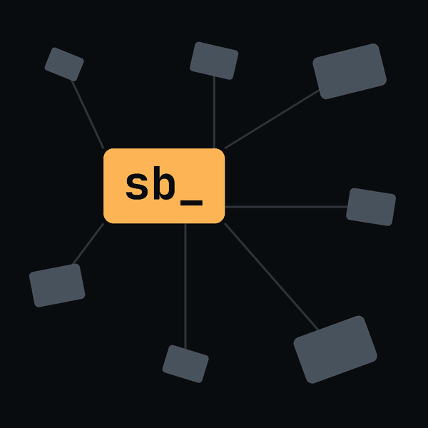

<p align="center">
  
</p>

# snapback

A live board for all your Claude Code sessions and agents


Terminal board for Claude Code: every session and background agent across your repos and worktrees, live. See which agent needs you, reply or stop it without leaving, and find any session by what was said.

For developers who run Claude Code in many repos and worktrees at once.

- **One live board** — the repo and all its worktrees grouped by branch, `-a` for every repo, updating as agents write.
- **Agent status at a glance** — needs input, working, done, failed.
- **Act without leaving** — `Ctrl-R` reply, `Ctrl-K` stop, `Ctrl-N` start a background agent (optionally one of your agents, model per message), `Enter` resume or attach and return to the board.
- **Find a session by what was said** — `Tab` searches transcripts and the preview jumps to the hit.
- **Background hand-off copies folded** into one `(+N)` row.

## Install

```sh
npx snapback-tui install
# or
bunx snapback-tui install
```

Installs prebuilt binaries for macOS (arm64/x64) and Linux (x64/arm64) — no Rust toolchain needed. The npm package is `snapback-tui`; the commands it installs are `snapback` and `sb`. To install somewhere other than `~/.local/bin`, set `SNAPBACK_INSTALL_DIR`. To uninstall, delete the two binaries — `install` prints the exact command.

### From source

Needs the Rust toolchain ([rustup.rs](https://rustup.rs)):

```sh
# from a local checkout:
cargo install --path .

# or straight from GitHub, latest main:
cargo install --git https://github.com/ilfroloff/snapback

# or a specific pinned release:
cargo install --git https://github.com/ilfroloff/snapback --tag vX.Y.Z
```

Pick `vX.Y.Z` from the [Releases page](https://github.com/ilfroloff/snapback/releases).

## Quick start

```sh
sb        # this folder's sessions
sb -p     # this project: the repo and all its worktrees
sb -a     # every folder, grouped repo → branch
```

| Key | Action |
| --- | ------ |
| `Tab` | search transcripts as well as names |
| `Enter` | resume or attach, then return to the board |
| `Ctrl-R` | quick reply |
| `Ctrl-K` | stop an agent |
| `Ctrl-N` | start a background agent |
| `Esc` | clear search / quit |

All keys: `sb --help` · Full guide: [docs/GUIDE.md](docs/GUIDE.md)

## Safety

snapback reads your sessions; the only file it writes is its hidden-session list under `~/.config/snapback`. Delete always asks first.

## Requirements

`claude` on your `PATH`; macOS or Linux.

## Contributing

See [`AGENTS.md`](AGENTS.md).

## License

Apache-2.0 — see [LICENSE](LICENSE).
